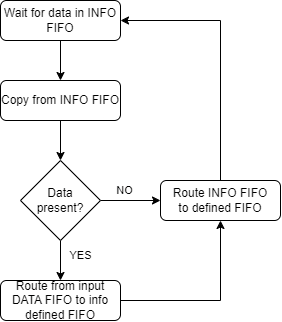

# Vnitřní protokol obvodu

Popis systému předávání dat z hlavní sběrnice vedlejším a generování zpráv z vedlejší zběrnice pro hlavní.

## Příjem dat

## Odeslání dat

# Konfigurační registry
| Registr | Přístup | <7> | <6> | <5> | <4> | <3> | <2> | <1> | <0> |
| :---: | :---: | :---: | :---: | :---: | :---: | :---: | :---: | :---: | :---: |
|    0    |    W    | přesměrován do vstupních dat (max 256 B)            ||||||||
|    1    |    W    | Reset |Sudá/Lichá parita (0/1)|Povolit parity bit| ----- | Automatické hlášení chyb |bitrate <2>|bitrate <1>|bitrate <0>|
|    2    |   RW    | ----- | Povolit příchozí data bez požadavku (full duplex) | Povolit timeout | Timeout v počtu bajtů <4> | Timeout v počtu bajtů <3> | Timeout v počtu bajtů <2> | Timeout v počtu bajtů <1> | Timeout v počtu bajtů <0> |
|    3    |    R(W)    |Šum příznak|Neočekávaná zpráva|-----|-----|Špatná velikost příchozích dat|Parita příznak|Timeout příznak|Frame příznak|

Time out je čas inaktivity sběrnice který ukončí komunikaci. Pokud jsou povolena příchozí data bez požadavku, nelze timeout vypnout
( při vypnutí bude timeout roven 1) a timeout nebude chyba ale bude určovat ukončení jedné komunikace.
|  Délka timeoutu  | REGISTR 2 |
| :--------------: |:---------:|
|   bez timeoutu   | xx0xxxxx  |
|   1 +  0 =  1    | xx100000  |
|   1 +  1 =  2    | xx100001  |
|   1 +  2 =  3    | xx100010  |
|   1 +  3 =  4    | xx100011  |
|      -----       |   -----   |
|   1 + 31 = 32    | xx111111  |
## Poznámky
 Některá nastavení nejsou podporována na všech sběrnicích, jako například povolení neočekávaných příchozích dat na I2C.
 
 Registr 3 (stavový registr) se resetuje po každém automatickém odeslání nebo při pokusu o zápis do registru 3.
 Reset bit resetuje ovladač sběrnice a ponechá hodnoty v konfiguračních registrech.
