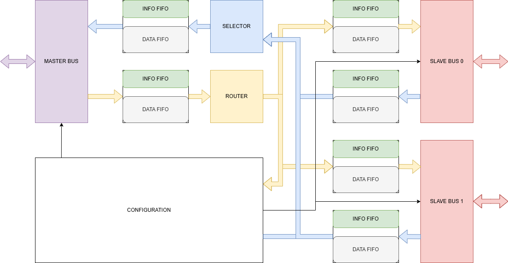
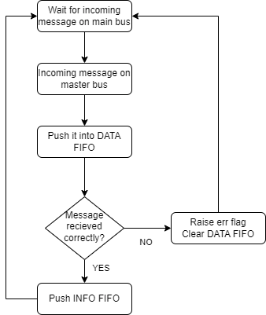
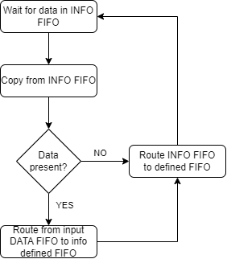
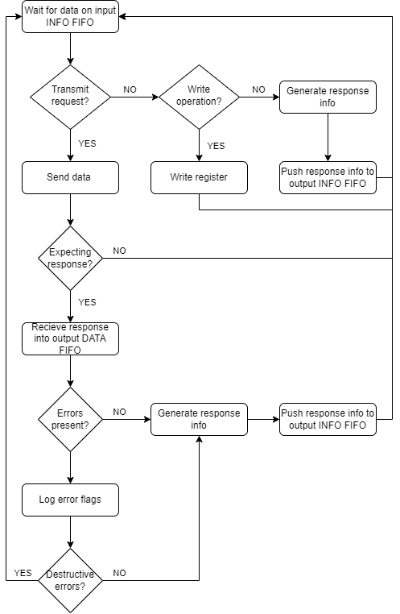
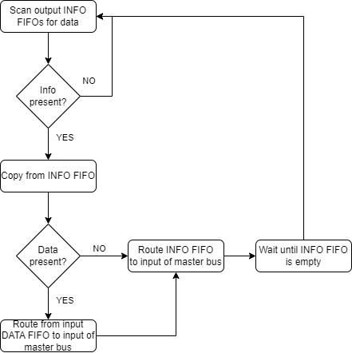

# Internal Circuit Protocol

Description of the data transfer system from the master bus to the slave buses and message generation from the slave bus to the master bus.

## Data Reception

  
  

## Data Transmission

